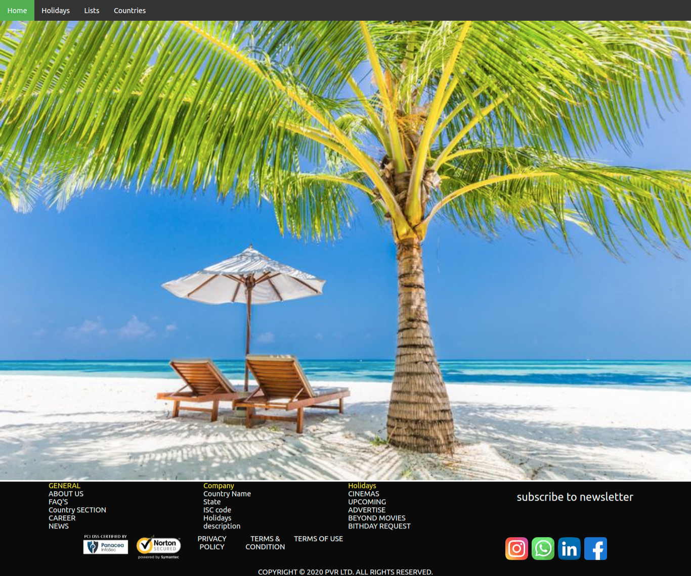

# Holiday-app

# Table of Contents:
1.General Information
2.Technologies
3.SetUp
4.Features

# 1.General Information

Holiday app gives you information about all holiays of a particular Country. If you want to see date wise holiday , past holodays , you can easily check in this holiday app. It is user-friendly with attractive views .

# 2. Technologies

React 
Material-ui
CSS
HTML
Javascript

# 3. SetUP

To run this project,install it Locally using npm
npm install
git clone https://github.com/madhurisonawat/Holiday-app.git
npm run start

# Image of app
!()
